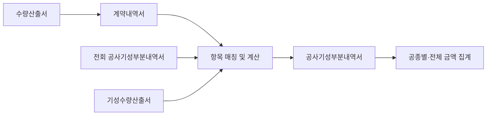
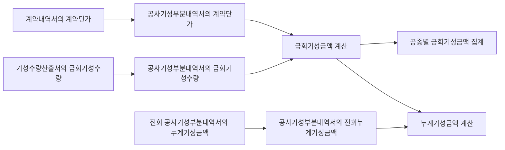
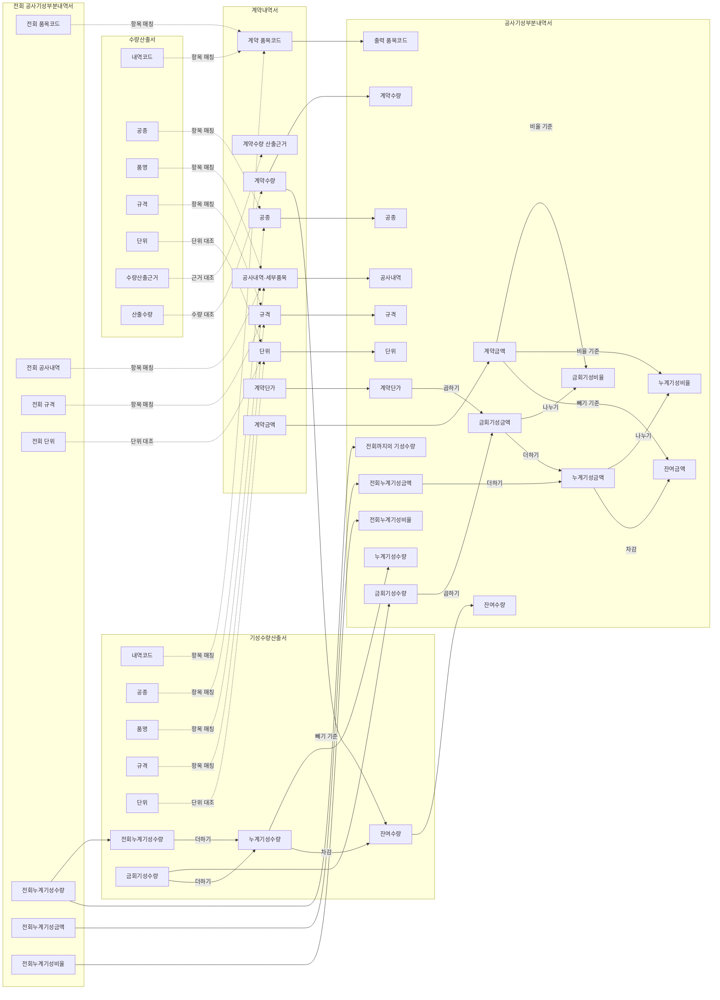

# 공사기성부분내역서 작성을 위한 온톨로지

이 프로젝트는 건설 프로젝트의 기성서류를 구조화하고, 공사기성부분내역서 작성(특히 금회기성금액)에 필요한 데이터 관계를 표현하는 온톨로지 구축을 목적으로 함.

기성서류의 종류와 항목, 서류 간 데이터 전달, 항목 매칭 및 기성금액 계산 흐름을 RDF + RDFS로 정의함.

대상 공종은 철근콘크리트이며, 철근콘크리트의 상세 속성은 철근, 콘크리트, 거푸집 및 동바리로 정의함.


## 현재 진행도

기성서류 작성 흐름과 데이터 정의를 바탕으로 1차 온톨로지를 구축함.
현재 버전에서는 RDF + RDFS로 클래스·속성·관계를 정의하고, SPARQL 질의를 이용하여 주요 계산 및 데이터 연결 구조를 검증하였음.

## 1. Ontology 설명

### 1-1. Prefix

온톨로지의 기본 Prefix는 `rcpp(Reinforced Concrete Progress Payment)`

```turtle
@prefix rcpp: <https://example.org/rcpp#> .
(현재는 임시 IRI)
```


### 1-2. Class


- 프로젝트 및 기성회차: `Project`, `ProgressPaymentRound`
- 기성서류: `ProgressDocument`, `QuantityCalculationSheet`, `ContractStatement`, `PreviousProgressStatement`, `CurrentProgressQuantitySheet`, `CurrentProgressStatement`
- 서류 내역: `DocumentItem`, `QuantityCalculationItem`, `ContractStatementItem`, `PreviousProgressStatementItem`, `ProgressQuantityDetailItem`, `CurrentProgressQuantityItem`, `CurrentProgressDetailItem`, `CurrentProgressSummaryItem`
- 표준 비용항목: `CostItem`, `RebarCostItem`, `ConcreteCostItem`, `ReadyMixedConcreteCostItem`, `ConcretePlacementCostItem`, `FormworkCostItem`, `ShoringCostItem`
- 서류내역 매칭: `DocumentItemMatching`
- 계산규칙 및 계산활동: `CalculationRule`, `UnitConversionRule`, `ProgressQuantityRollupCalculation`, `CurrentProgressAmountCalculation`, `ProgressSummaryCalculation`, `CalculationActivity`

### 1-3. Property


- 계약내역: `contractItemCode`, `contractWorkType`, `contractItemName`, `contractSpecification`, `contractUnit`, `contractQuantity`, `contractUnitPrice`, `contractAmount`
- 수량산출: `quantityFormula`, `quantityCalculationBasis`, `quantityCalculatedQuantity`
- 기성수량: `progressPreviousCumulativeQuantity`, `progressCurrentQuantity`, `progressCumulativeQuantity`, `progressRemainingQuantity`
- 기성금액: `outputPreviousAmount`, `outputCurrentAmount`, `outputCumulativeAmount`, `outputRemainingAmount`
- 단위변환 및 계산정책: `baseUnit`, `conversionFactorToBaseUnit`, `roundingMode`, `decimalScale`, `calculationOrder`
- 공종별 비용속성: `rebarGrade`, `nominalDiameter`, `maximumAggregateSize`, `nominalStrength`, `slump`, `formworkType`, `reuseCount`, `shoringType`

### 1-4. Relation


- `containsItem`: 서류와 서류 내역 연결
- `representsCostItem`: 서류 내역과 표준 비용항목 연결
- `correspondsToItem`: 승인된 동일 서류 내역 연결
- `usesUnitPriceFrom`: 기성 상세내역과 계약단가 원천 연결
- `quantityBasisFrom`: 계약수량과 수량산출 근거 연결
- `previousQuantityFrom`: 전회누계수량의 이월 원천 연결
- `derivedFrom`: 결과 내역과 원천 내역 연결
- `quantityAggregatedInto`: 상세 기성수량을 계약항목 단위 수량으로 집계
- `aggregatedInto`: 상세 금액을 공종별 집계 내역으로 합산
- `groupsByField`: 상세 내역을 공종별로 묶는 기준 연결

### 1-5. 기성서류 데이터 흐름



### 1-6. 항목 흐름도




### 1-7. 데이터 정의도



실선은 원천값의 직접 전달 또는 계산 입력을, 점선은 동일 항목의 매칭·대조를 나타낸다. 계약정보는 계약내역서에서, 전회 확정값은 전회 공사기성부분내역서에서, 금회 수량은 기성수량산출서에서 가져오며 계산된 금액과 비율은 공사기성부분내역서에 기록한다.


## 2. 실행 방법

### 2-1. Conda 환경 생성

```bash
conda create -n RC_Ontology python=3.10.14 -y
```

### 2-2. Conda 환경 활성화

```bash
conda activate RC_Ontology
```

### 2-3. 패키지 설치

```bash
conda install -y pip
pip install -r requirements.txt
```

### 2-4. 시각화 생성

```bash
cd KO
python visualization/generate_visualization_data.py
```

생성된 `KO/visualization/ontology_graph.html` 파일을 브라우저에서 열어 시각화 확인.

## 3. 파일 구성

- `KO/ontology/schema.ttl`: 온톨로지 정보와 네임스페이스
- `KO/ontology/classes.ttl`: 클래스와 클래스 계층
- `KO/ontology/properties.ttl`: 속성과 관계
- `KO/ontology/code-lists.ttl`: 공종·단위·통제값과 규칙 개체
- `KO/ontology/ONTOLOGY_SPECIFICATION.md`: 클래스·속성·규칙·통제값과 내부 관계 트리플 명세서
- `KO/visualization/ontology_graph.html`: 온톨로지 시각화

## 4. 버전

- Ontology version: `v1.0.0`
- Namespace: `https://example.org/rcpp#`
